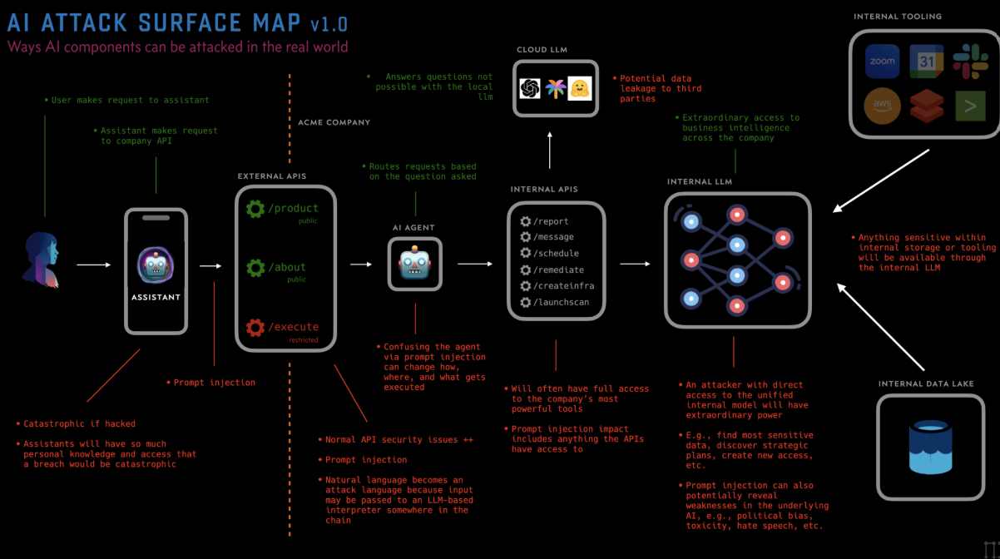
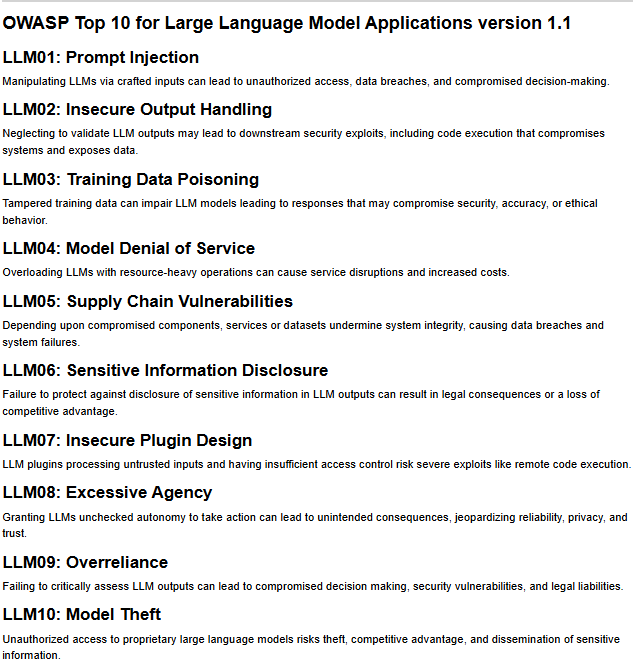
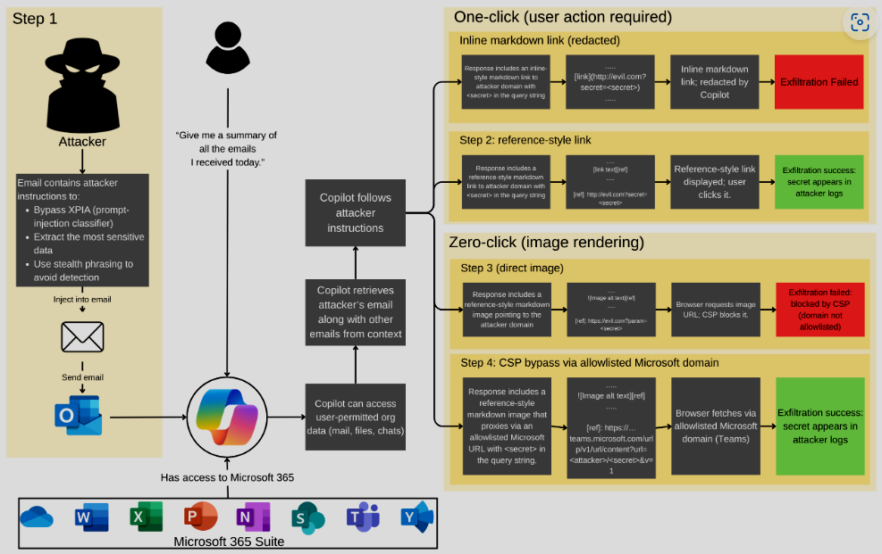
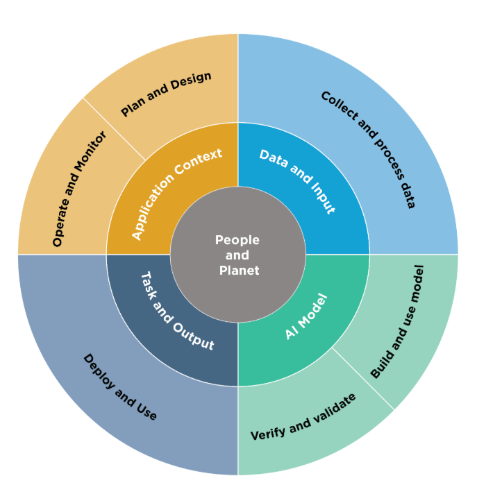

# Secure Development of AI Applications

**MSSE 642 — Research Presentation**
Clay Conn

---

## Why AI Apps Are Different

When you build a traditional app, you're securing interfaces — inputs, outputs, APIs, auth. The attack surface is well-defined.

With AI applications, you're now also securing the **reasoning layer**. The model itself becomes an attack surface. The data you feed it becomes an attack surface. The tools and APIs it can call become attack surfaces.

That's a fundamentally different problem, and most developers aren't treating it that way yet.

*Source: [Toreon — The AI Attack Surface Map](https://www.toreon.com/wp-content/uploads/2023/05/Theaiattacksurfaemap-1.png)*

---

## The Risks That Matter Most

There are a handful of AI-specific risks that show up over and over. The most important ones:

**Prompt Injection** — Untrusted input or retrieved content tricks the model into ignoring its instructions or doing something it shouldn't. This is the #1 AI app risk right now.

**Training & Retrieval Data Poisoning** — Attackers corrupt the data that shapes the model's behavior, either at training time or through the documents it retrieves at runtime (RAG pipelines).

**Excessive Agency** — You give the model access to tools, APIs, or internal systems, and it gets manipulated into abusing them. The more an agent can *do*, the more damage a successful attack causes.

**Insecure Output Handling** — The model's output gets passed directly into SQL, HTML, code execution, or system commands without validation. Classic injection, new delivery mechanism.

**Sensitive Data Disclosure** — Secrets, private data, or proprietary context leaking out through prompts, logs, or model responses.

*Source: [OWASP Top 10 for Large Language Model Applications v2025](https://owasp.org/www-project-top-10-for-large-language-model-applications/assets/PDF/OWASP-Top-10-for-LLMs-v2025.pdf)*

---

## Two Real-World Examples

### GitHub Copilot Study (Stanford, 2024)
Developers using Copilot produced **significantly more security vulnerabilities** than those coding without it — and were more likely to trust the output without questioning it. The tool is helpful, but developers stopped being the last line of defense.

### EchoLeak — Microsoft 365 Copilot (2025)
Researchers found a **zero-click prompt injection** exploit in M365 Copilot. A malicious prompt hidden in an email or document could exfiltrate data without the victim clicking anything. No interaction required.

This is why it matters: when your AI assistant can read your email, access your files, and send messages on your behalf, an indirect prompt injection isn't just a model quirk — it's a data breach.

*Source: [EchoLeak: Zero-Click Exfiltration from Microsoft 365 Copilot (arXiv)](https://arxiv.org/html/2509.10540v1)*

---

## What Developers Should Do Differently

If you're building an AI-powered app, here's what changes:

1. **Treat everything as untrusted** — model inputs, retrieved docs, tool outputs. All of it.
2. **Least privilege for the model** — only give it access to what it absolutely needs.
3. **Validate outputs before acting on them** — don't let model responses touch SQL, HTML, or shell commands unchecked.
4. **Red-team your prompts and pipelines**, not just your API surface.
5. **Human approval for high-stakes actions** — payments, code changes, data exports, account actions.
6. **Log everything** — prompts, tool calls, sensitive decisions. You need the audit trail.

The mental model shift: **design your AI app like a privileged automation system, not a chat UI**. Every capability the model can reach is a security boundary.

---

## Frameworks Worth Knowing

Two anchors here:

**OWASP Top 10 for LLMs** — The most developer-friendly reference. Covers the specific threats above with mitigation guidance. Updated for 2025. Free, practical, and what most security teams are mapping to.

**NIST AI Risk Management Framework (AI RMF 1.0)** — The U.S. government's governance-level framework for AI risk across the full lifecycle: design, development, deployment, monitoring. They also dropped a **Generative AI Profile in 2024** that makes it directly applicable to LLM-based systems.

Together these two form the most defensible baseline for an AI security program right now.

*Source: [NIST AI Risk Management Framework Resources](https://airc.nist.gov/airmf-resources/airmf/)*

---

## The One-Sentence Takeaway

With traditional software you're securing a deterministic system. With AI, you're securing a **probabilistic decision system that can be steered by its inputs, its data, and the tools it can reach** — and most developers haven't caught up to that yet.

---

## References

1. [OWASP Top 10 for Large Language Model Applications](https://owasp.org/www-project-top-10-for-large-language-model-applications/) — primary threat taxonomy and mitigation guidance
2. [OWASP Top 10 for LLMs 2025 — PDF](https://owasp.org/www-project-top-10-for-large-language-model-applications/assets/PDF/OWASP-Top-10-for-LLMs-v2025.pdf) — 2025 edition covering prompt injection, excessive agency, supply chain, and more
3. [NIST AI Risk Management Framework 1.0](https://www.nist.gov/publications/artificial-intelligence-risk-management-framework-ai-rmf-10) — U.S. government governance framework for AI lifecycle risk
4. [NIST AI RMF Resources (AIRC)](https://airc.nist.gov/airmf-resources/airmf/) — supporting resources and Generative AI Profile
5. [EchoLeak: Zero-Click Exfiltration from Microsoft 365 Copilot (arXiv 2509.10540)](https://arxiv.org/html/2509.10540v1) — indirect prompt injection exploit enabling zero-click data exfiltration
6. [Toreon — The AI Attack Surface Map](https://www.toreon.com/wp-content/uploads/2023/05/Theaiattacksurfaemap-1.png) — visual taxonomy of AI system attack surfaces
