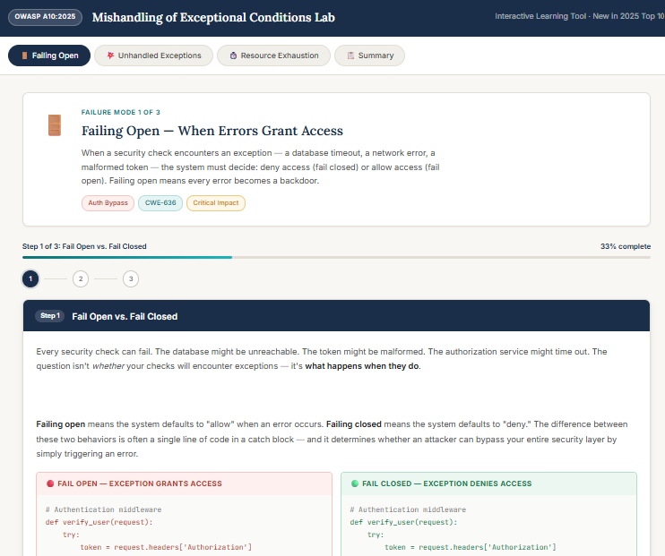
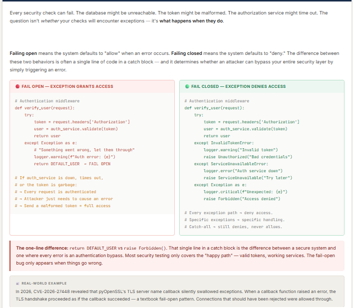
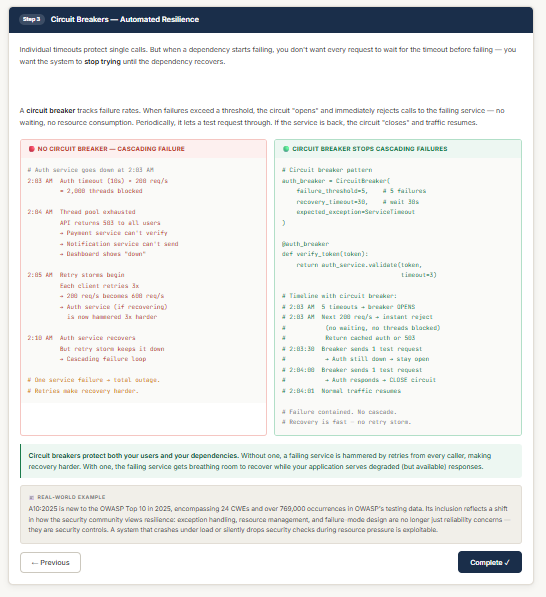
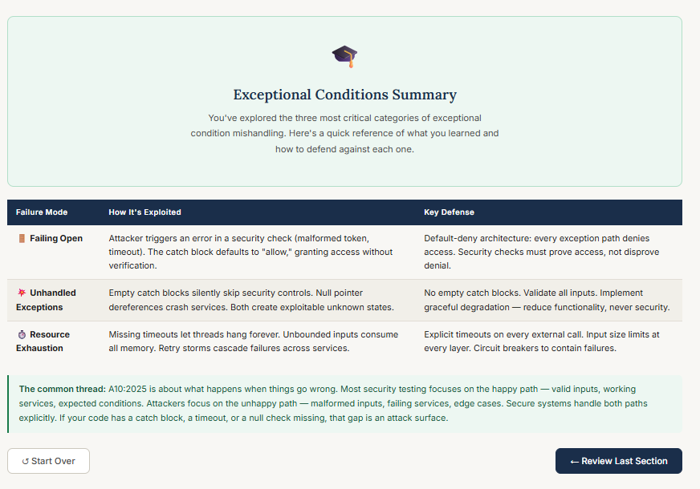

# Vibe Coding Assignment #2
**OWASP A10:2025 — Mishandling of Exceptional Conditions**

*AUTHOR: CLAYTON CONN*

*CLASS: MSSE 642 - SOFTWARE ASSURANCE*

*DATE: 6/5/2026*

---

## 1. Overview: Vibe Coding Tool

For this assignment I again used **Claude (claude.ai)** as my primary vibe coding tool. Like assignment 1, the output is a single self-contained HTML file that opens directly in a browser with no server or install required.

I stayed with Claude for the same core reasons as before: it handles a full-stack single-file app very well, and I prefer starting the process with a conversation about what I want to build before writing any code. For this project specifically, the conversational approach mattered more than usual — A10:2025 involves three distinct failure modes that needed to be scoped carefully up front, and Claude's back-and-forth format is well-suited to that kind of design thinking before any code is written.

## 2. Description of the Program

The app is an **interactive, step-by-step exceptional conditions simulator** built as a single HTML file. It covers three of the most critical failure modes under OWASP A10:2025:

1. **Failing Open** — when an error in a security check defaults to "allow" instead of "deny"
2. **Unhandled Exceptions** — empty catch blocks that silently skip security controls, and null pointer dereferences that crash services into an unknown state
3. **Resource Exhaustion & Missing Timeouts** — unbounded inputs, hanging threads, and missing circuit breakers that let attackers exhaust server resources

Like the supply chain simulator from assignment 1, the design uses a **guided walkthrough format** with Next/Back navigation, a progress bar, and step indicators. Each of the three failure modes has three steps, and each step includes:

- A narrative explanation of the concept and what's at stake
- A side-by-side **Vulnerable vs. Secure** code panel — often the difference is a single line
- A callout box summarizing the key rule
- A real-world CVE or incident showing the concept in the wild

*Figure 1. Landing page showing the three failure mode tabs (Failing Open, Unhandled Exceptions, Resource Exhaustion) and the introductory Failing Open card.*

*Figure 2. Failing Open — Step 1 side-by-side code comparison showing how a vulnerable catch block returns a default user versus a secure implementation that raises a Forbidden exception.*

*Figure 3. Resource Exhaustion — Step 3 demonstrating the circuit breaker pattern, contrasting an unprotected endpoint with one that enforces connection limits and timeouts.*

*Figure 4. Summary tab consolidating all three A10:2025 failure modes and their corresponding defenses in a single reference view.*

The goal was the same as assignment 1: make it feel less like reading a definition and more like walking through how an attack unfolds — so the *why* behind each fix is clear, not just the *what*.

## 3. The Vulnerability: A10:2025 — Mishandling of Exceptional Conditions

Mishandling of Exceptional Conditions is a **new entry in the OWASP Top 10 for 2025**, ranked #10 (OWASP, 2025). The category encompasses 24 CWEs and was found in over 769,000 occurrences in OWASP's application testing data, mapped across 3,416 CVEs. Its inclusion as a distinct category signals a shift in how the security community classifies these bugs: exception handling failures are no longer treated as a code quality issue — they are a direct attack surface.

### What the Vulnerability Covers

The category covers three distinct but related failures. **Failing open** is when a security check encounters an exception — a database timeout, a malformed token, a service outage — and defaults to allowing access instead of denying it. The difference between secure and vulnerable is often a single line in a catch block: `return DEFAULT_USER` versus `raise Forbidden()`. **Unhandled exceptions** include empty catch blocks that silently skip security controls and null pointer dereferences that crash services — both conditions an attacker can deliberately trigger. **Resource exhaustion** covers missing timeouts, unbounded inputs, and retry storms: a single 2 GB JSON payload or 200 concurrent connections to a no-timeout endpoint can exhaust a thread pool and bring down a service without any traditional exploit.

### Recent Attacks Using This Vulnerability

A few high-profile incidents relate directly to A10:2025:

- **CrowdStrike (July 19, 2024)** — A configuration update to CrowdStrike's Falcon sensor triggered an out-of-bounds memory read in a Windows kernel-level driver. The update contained more fields than the driver expected, and missing bounds checking caused it to read invalid memory. The result: 8.5 million Windows machines crashed simultaneously. Airlines, hospitals, banks, and emergency services were disrupted globally in what was widely reported as the largest IT outage in history (Satter & Pearson, 2024).

- **CVE-2025-0108 — Palo Alto Networks PAN-OS (February 2025)** — An authentication bypass in PAN-OS's management web interface allowed unauthenticated attackers with network access to invoke PHP scripts without credentials. The root cause was a fail-open pattern in the authentication handling logic — not a cryptographic weakness (Palo Alto Networks, 2025).

---

## 4. Problems Encountered and How I Solved Them

**Problem 1: Claude ran ahead before I had scoped the design.**
When I started the session I gave Claude a general description of A10:2025 and it immediately started producing an app before I had worked out how to structure the three failure modes. The first version organized the content differently than I wanted and I had to significantly revise the approach. I've learned from this: starting with "ask me clarifying questions before you build anything" would have saved that revision cycle. For assignment 3, that is the first thing I plan to prompt.

**Problem 2: The initial aesthetic needed adjustment.**
Like assignment 1, the first output used a darker, more technical color scheme that felt like a developer tool rather than a learning environment. I redirected Claude toward the same academic aesthetic from the supply chain project — cream background, navy accents, Inter and Lora typography — so the two apps feel like they belong to the same course rather than two separate experiments.

## 5. References

- OWASP. (2025). *OWASP Top 10:2025*. https://owasp.org/Top10/2025/

- Palo Alto Networks. (2025, February 11). *CVE-2025-0108: PAN-OS: Authentication bypass in the management web interface*. https://security.paloaltonetworks.com/CVE-2025-0108[web:9]

- OpenPrinting. (2025). *CVE-2025-58060: Authentication bypass in CUPS*. https://github.com/OpenPrinting/cups/security/advisories/GHSA-4c68-qgrh-rmmq

- Satter, R., & Pearson, J. (2024, July 19). *Global tech outage caused by CrowdStrike software update*. Reuters. https://www.reuters.com/technology/crowdstrike-says-actively-working-with-customers-impacted-by-outage-2024-07-19/