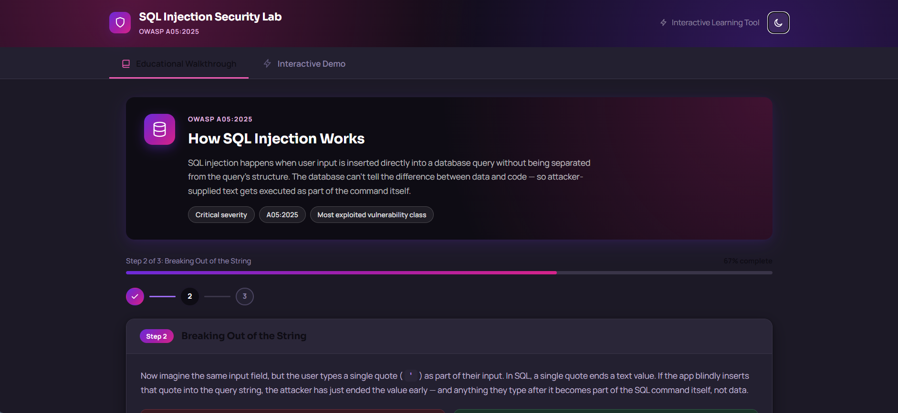
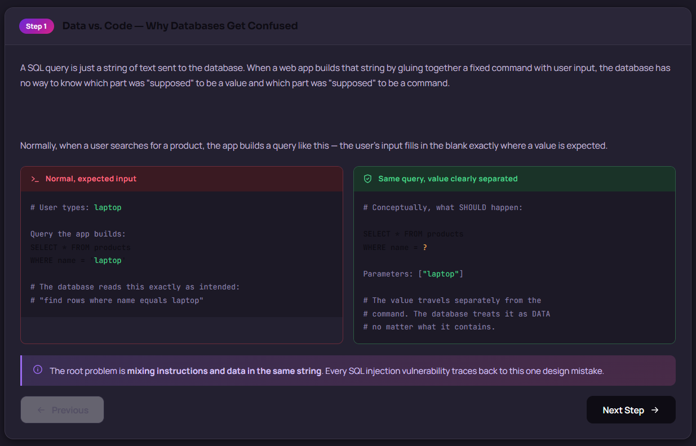
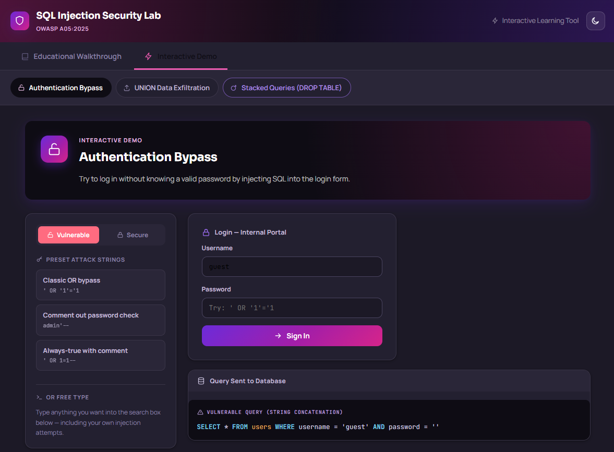
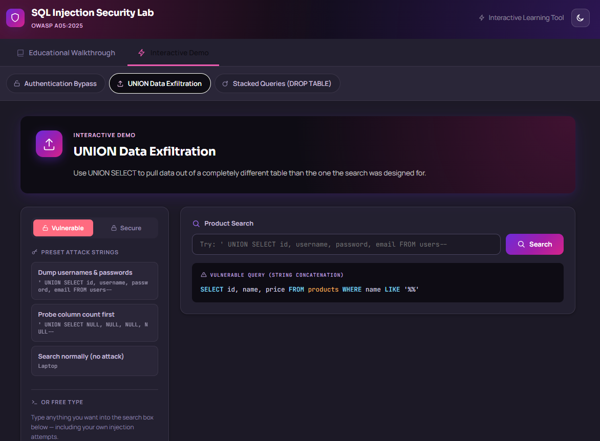
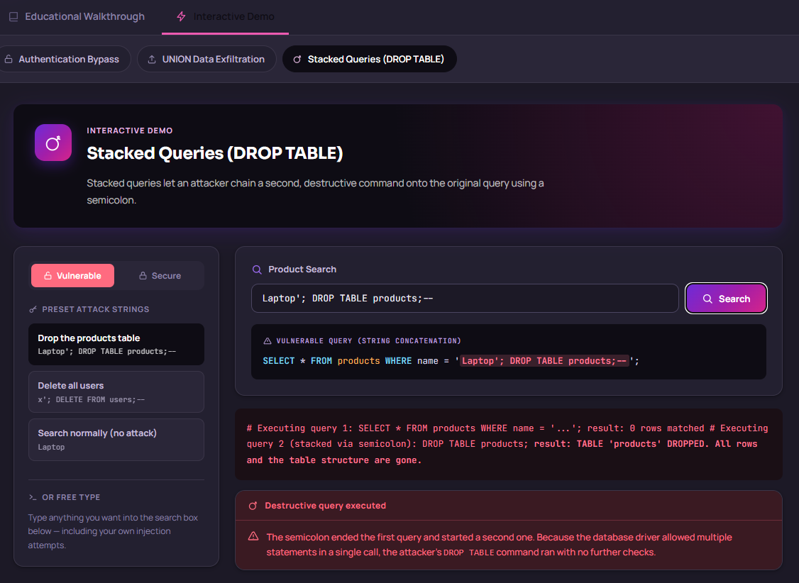
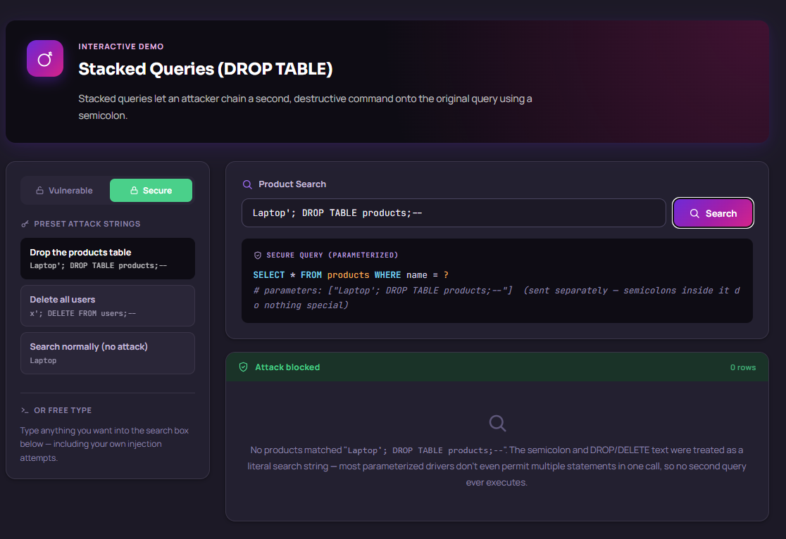

# Vibe Coding Assignment #3
**OWASP A05:2025 — SQL Injection**

*AUTHOR: CLAYTON CONN*

*CLASS: MSSE 642 - SOFTWARE ASSURANCE*

*DATE: 06/19/2026*

---

## 1. Overview: Vibe Coding Tool
The tool I used was Claude (Anthropic's AI coding assistant, accessed via Claude.ai/Claude Code). I planned using Opus 4.8, and created the application with Sonnet 4.6. I choose two different models becasue Opus thinks deepr and is best used for planning purposes. Sonnet took the plan generated from Opus and created the application which uses less tokens overall. I chose Claude overall because I have had past success at generating self-contained, structured front-end code from a high-level description — I could describe what I wanted the lab to teach and do, and Claude translated that into working HTML, CSS, and JavaScript in one shot. Since this project is entirely client-side with no build toolchain, the vibe coding workflow matched perfectly: prompt, review, iterate. There were a few minor tweaks to the output claude generated, but overall it was a very smooth project 3 build since claude had context from past assignments. 

 
 
## 2. Description of the Program
The program is a **single-file interactive security lab** (vibe-code-proj3-sql-inj.html) that teaches SQL Injection entirely in the browser with no backend or dependencies. I chose this format because it is zero-install and shareable — anyone can open the file and interact with it immediately.

The lab has two modes:

**Educational Walkthrough** — a 3-step guided explanation of how SQL injection works, with side-by-side vulnerable vs. secure code comparisons at each step.
**Interactive Demo** — a simulated database environment (JavaScript in-memory) where users can try three real attack classes:
Authentication bypass (`' OR '1'='1`)
UNION-based data exfiltration (dumping a simulated `users` table into product search results)
Stacked queries / destructive commands (`'; DROP TABLE products;--`)
A toggle switches between Vulnerable and Secure mode so students can see exactly how parameterized queries block the same inputs that compromise the vulnerable version. A live query renderer highlights injected syntax in real time as you type.

*Figure 1. Landing page showing the SQL Injection Security Lab header and the OWASP A03:2025 educational walkthrough intro card.*

*Figure 2. Walkthrough Step 1 — "Data vs. Code" side-by-side comparison showing a normal product query versus the same query with a parameterized placeholder.*

*Figure 3. Interactive demo — Authentication Bypass in vulnerable mode. The classic `' OR '1'='1` payload causes the database to log the attacker in as admin without a valid password.*

*Figure 4. Interactive demo — UNION Data Exfiltration. The injected UNION SELECT merges the users table (including plaintext passwords) into the product search results.*

*Figure 5. Interactive demo — Stacked Queries. A semicolon chains a destructive DROP TABLE command onto the search query, wiping the products table from the simulated database.*

*Figure 6. Secure mode toggle — the same injection string is treated as a literal value. The parameterized query blocks all three attack types with no special filtering logic.*

## 3. The Vulnerability: A03:2025 — SQL Injection
SQL injection occurs when user-supplied input is concatenated directly into a SQL query string. The database has no way to distinguish the developer's intended command structure from attacker-supplied data, so a single unescaped quote character can let an attacker rewrite the query's logic entirely — bypassing authentication, reading arbitrary tables, or issuing destructive commands like `DROP TABLE`.

The fix is structural: parameterized queries / prepared statements send the query template and the user value as separate artifacts, so the database driver never parses the value as SQL syntax.

### Why It Matters Now
SQL injection has appeared in every OWASP Top 10 list since the list's inception; it remains one of the most reliably exploited vulnerability classes because it requires only an HTTP request to trigger.

### Recent Attacks Using This Vulnerability
- **2023 — MOVEit Transfer (Cl0p ransomware group):** A SQL injection flaw in Progress Software's MOVEit file-transfer product was exploited at scale, affecting hundreds of organizations including the BBC, British Airways, and multiple U.S. federal agencies. Millions of records were exfiltrated.
- **2023 — Fortra GoAnywhere MFT:** Another managed file-transfer product hit with SQL injection–related CVEs, again leveraged by Cl0p.
- **2024 — Various Ivanti products:** Ivanti Connect Secure appliances suffered injection-class vulnerabilities that enabled unauthenticated remote code execution, exploited by nation-state actors before patches were available.

---

## 4. Problems Encountered and How I Solved Them

**Problem 1: Theme and CSS Styling**
I encounted significanltly less problems with vibe coding these project becuase I learned to be more direct and target with my prompting rather than leaving things up for interpretation for Claude to decide. In my promptin I learned to make sure Claude asked questions if it was usnure of what to do rather than guess, which is where it would usually go down the wrong path. The other command I used was to ensure it doesn't guess, if Claude was unsure I prompted it to let me know before it guessed so we could walk thorugh the right steps. 

The only thing I changed was a small bug in the layout where the text for the demo input was never set so it remained black and hard to see. This was an easy fix, and I in fixing it I provided Claude with text of what was wrong and a picture to show what I was seeing. 

**My exact prompt to get started**
>I need to make another self contained OWASP Top 10 vulnerability analysis demo. >This week I want to look at SQL injection. 
>
>Help me create a demo of SQL injection and what correct defense would look like using it. For context, I will add the project outline in here for  you to reference. 
>
>Ask questions before you proceed. Dont assume anything and ask questions about everything you dont understand. If you unsure dont make guesses, if you absolutley have to notify me before making a guess.

## 5. References

Cybersecurity and Infrastructure Security Agency. (2024, January 19). Known exploited vulnerabilities: Ivanti Connect Secure and Policy Secure vulnerabilities (Advisory AA24-060B). U.S. Department of Homeland Security. https://www.cisa.gov/news-events/cybersecurity-advisories/aa24-060b

Fortra. (2023, February 1). GoAnywhere MFT zero-day vulnerability [Security advisory]. https://www.fortra.com/security/advisory/fi-2023-001

OWASP Foundation. (n.d.). SQL injection. https://owasp.org/www-community/attacks/SQL_Injection

Toulas, B. (2023, June 15). List of organizations hit by Clop’s MOVEit data theft attacks grows. BleepingComputer. https://www.bleepingcomputer.com/news/security/list-of-organizations-hit-by-clops-moveit-data-theft-attacks-grows/