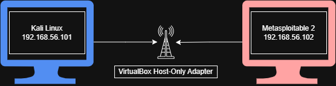
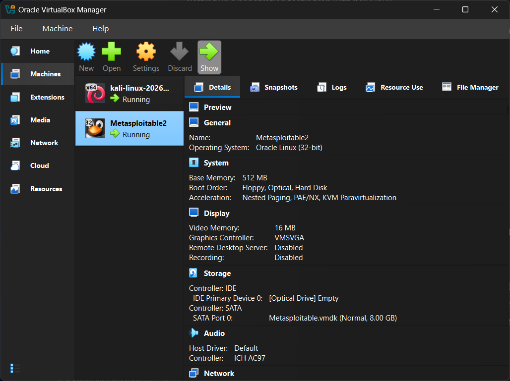
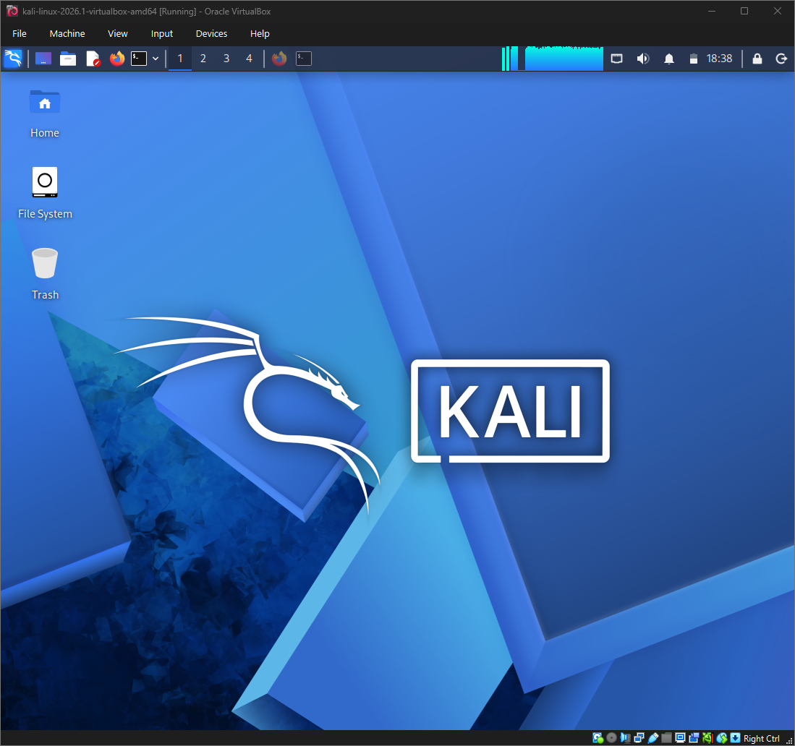
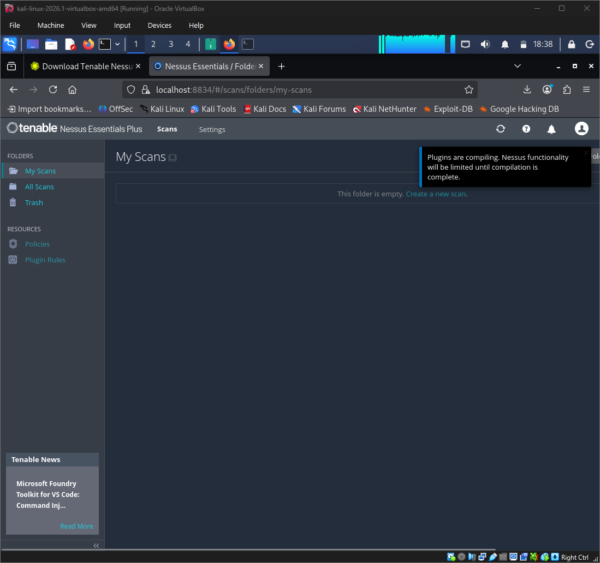
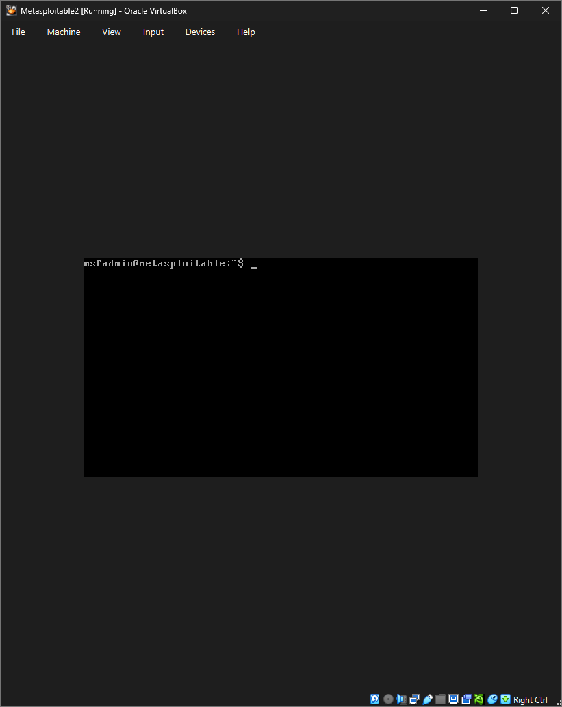
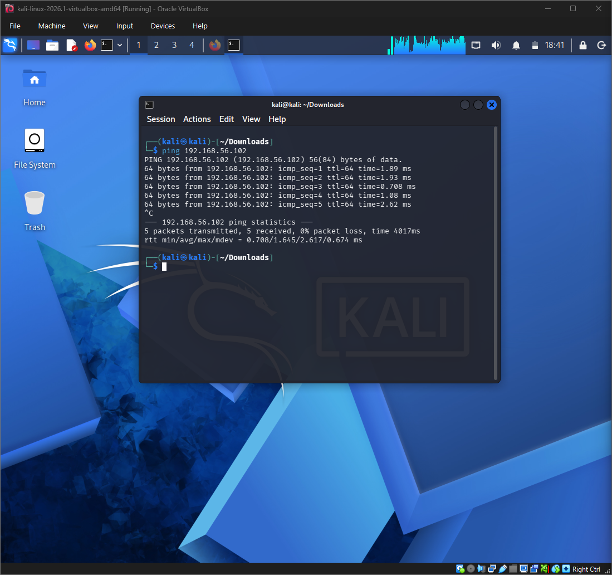
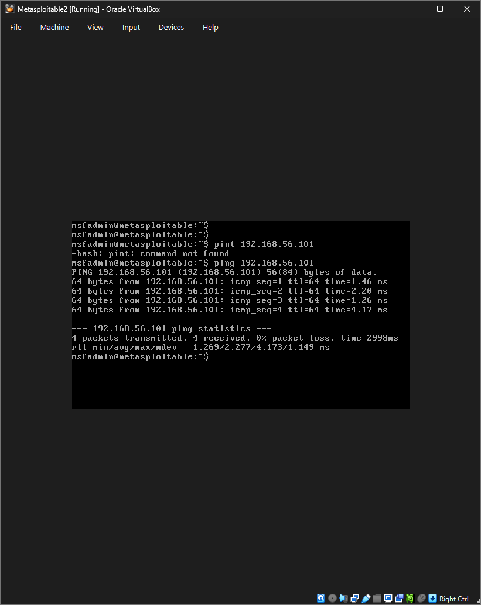

# Penetration Testing Lab Setup
**MSSE — Hands-On Assignment #1**
**Author:** Clayton Conn
**Date:** May 16 2026

---

## 1. Technology Stack Overview

This lab was set up on a personal Windows 11 machine using Oracle VirtualBox as the Type 2 hypervisor. A Type 2 hypervisor runs on top of an existing host operating system. VirtualBox was selected because it is free, open-source, and well-documented for penetration testing lab environments on Windows.

**Host Machine Specifications:**
- **Machine:** Acer Aspire A315-58
- **OS:** Windows 11 Home 64-bit
- **Processor:** Intel Core i7-1165G7 @ 2.80GHz
- **RAM:** 16GB
- **Hypervisor:** Oracle VirtualBox

**Virtual Machines:**
| VM | Role | OS | IP Address |
|----|------|----|------------|
| Kali Linux 2026.1 | Attacker | Debian-based Linux | 192.168.56.101 |
| Metasploitable 2 | Target | Ubuntu-based Linux (32-bit) | 192.168.56.102 |

---

## 2. Architectural Diagram

The diagram below illustrates the network topology of the virtual lab environment. Both virtual machines are connected through a VirtualBox Host-Only Adapter, which acts as a virtual switch. This configuration isolates the lab network from the host machine's external network, providing a safe and controlled environment for penetration testing practice.

- **Kali Linux** serves as the attacker machine, running penetration testing tools including Nessus and the Metasploit Framework.
- **Metasploitable 2** serves as the intentionally vulnerable target machine.
- Both machines communicate over the `192.168.56.0/24` subnet via the Host-Only Adapter.

---

## 3. VirtualBox Running Environment

The screenshot below shows Oracle VirtualBox Manager with both virtual machines running simultaneously.

---

## 4. Kali Linux Running and Logged In

The screenshot below shows the Kali Linux virtual machine running and logged in with the default `kali` user account.

---

## 5. Nessus Installed and Running

Nessus Essentials was installed on the Kali Linux VM. The installation was performed by first connecting a second adaptor for the Kali VM to have internet access. Next downloading the Debian `.deb` package from Tenable's website directly within the Kali browser, then installing it via the terminal using `dpkg`. The Nessus daemon was started using `systemctl` and is accessible at `https://localhost:8834`.

The screenshot below shows Nessus Essentials running in the browser on the Kali VM.

---

## 6. Metasploitable 2 Running

Metasploitable 2 is an intentionally vulnerable Linux virtual machine designed as a penetration testing target. It was downloaded as a `.vmdk` disk image and imported into VirtualBox by creating a new Linux (32-bit) VM around the existing disk file. Default credentials are `msfadmin / msfadmin`.

The screenshot below shows Metasploitable 2 booted and logged in.

---

## 7. Connectivity Verification — Ping Test

To verify that the two virtual machines could communicate over the Host-Only network, a ping test was performed from the Kali Linux VM targeting the Metasploitable 2 machine at `192.168.56.102`. A second ping test was perfomred from Metasploitable 2 machine targeting the Kali Linux VM at `192.168.56.101`. 

The screenshot below shows the two successful ping results with **0% packet loss**, confirming full network connectivity between the attacker and target machines.

---

## 8. Problems Encountered and Solutions

### Problem 1: VirtualBox Import Error — UUID Conflict
**Issue:** When attempting to import the Kali Linux VM using `File → Import Appliance`, VirtualBox returned the following error:
> *"Trying to open a VM config which has the same UUID as an existing virtual machine."*
> Result Code: E_FAIL (0x80004005)

This occurred because the downloaded Kali image was a pre-built `.vbox` file rather than a standard `.ova` file, and a partial import had already registered the UUID in VirtualBox.

**Solution:** Removing the already imported VM in VirtualBox fixed the issue. Simply opening the `.vbox` file in the windows file explorer imported the file into VirtualBox to be modified and run. 

---

### Problem 2: Kali Linux Required Temporary Internet Access for Nessus
**Issue:** Kali was configured with a Host-Only network adapter for lab isolation, which meant it had no internet access by default. Nessus needed to be downloaded from Tenable's website directly into Kali rather locally on windows.

**Solution:** A second network adapter was temporarily added to the Kali VM set to NAT, which provided internet access through the host machine. Nessus was downloaded and installed, and the NAT adapter was disabled afterward to maintain lab isolation.
