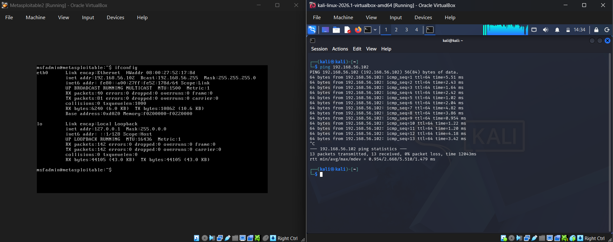
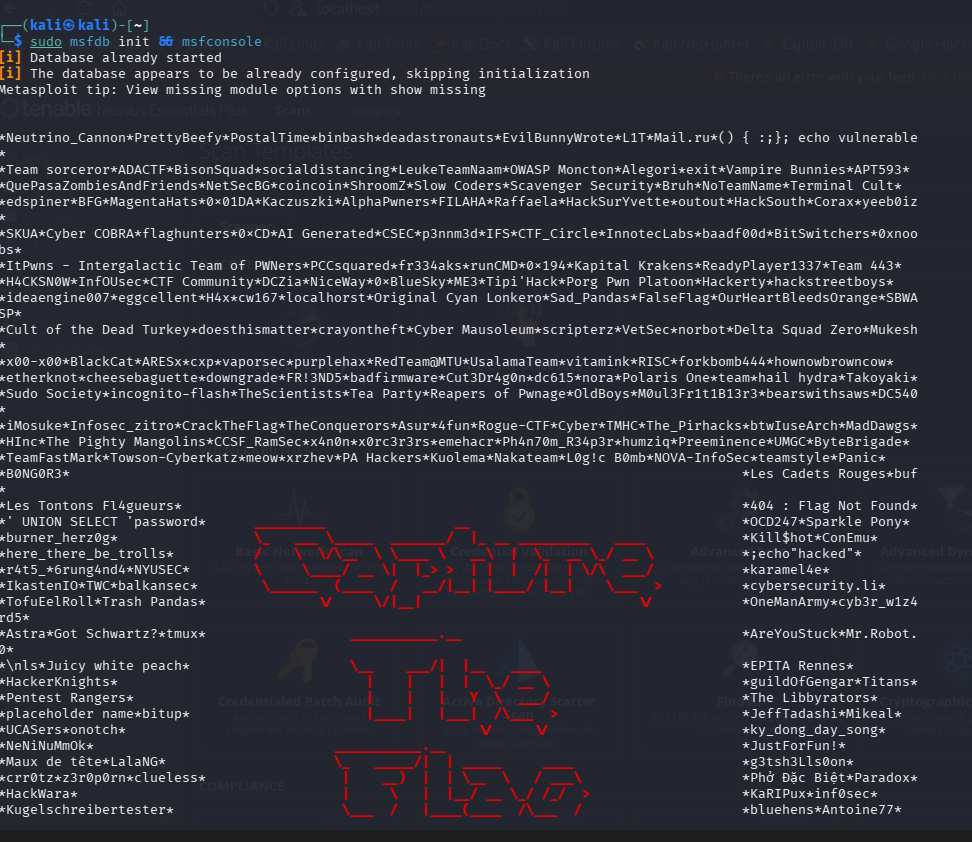
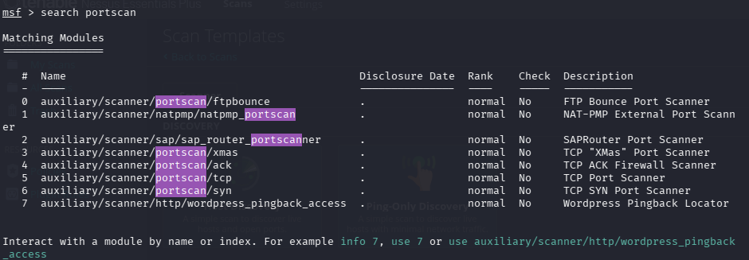
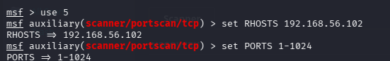
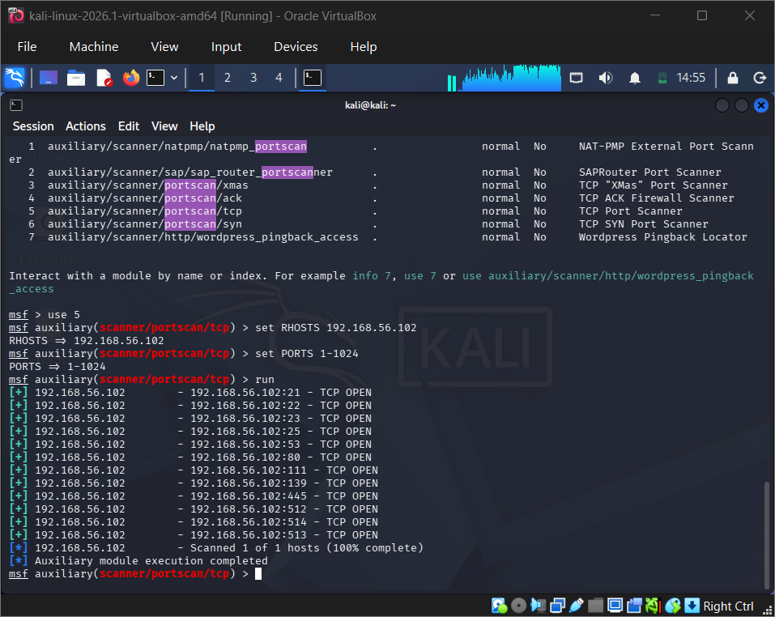
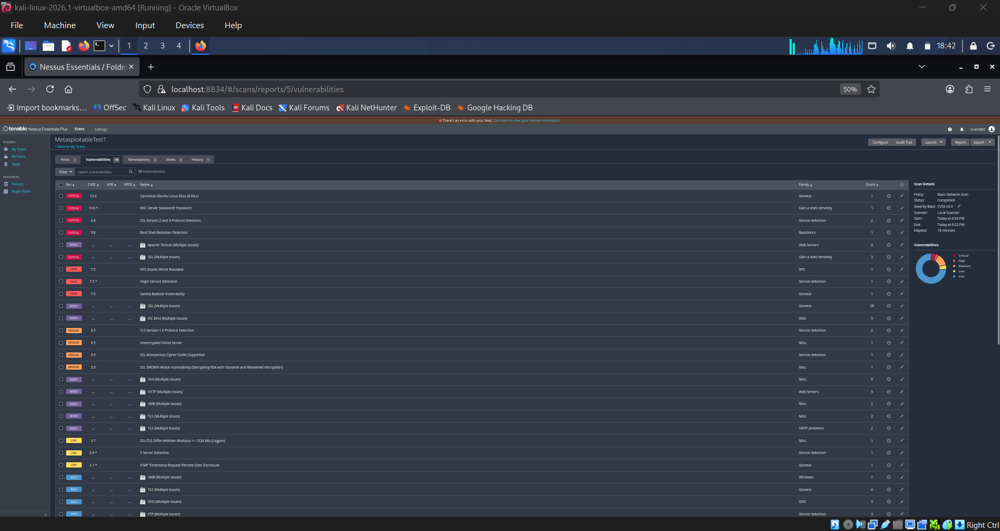

# Penetration Testing Lab
**MSSE 642 — Hands-On Project #3**<br>
**Author:** Clayton Conn<br>
**Date:** 2026-06-14

---

## Part 1: Lab Setup — Both VMs Running and Connected

The lab environment consists of two virtual machines running in VirtualBox on a host-only network:

- **Kali Linux** — the attacker machine
- **Metasploitable2** — the intentionally vulnerable target machine (IP: 192.168.56.102)

The screenshot below shows both VMs running simultaneously in VirtualBox, with a successful ping from Kali Linux to Metasploitable2 (192.168.56.102) confirming network connectivity.



---

## Part 2: Metasploit Port Scanning

### Scan Process

Port scanning was performed using the Metasploit Framework's built-in TCP port scanner module. The following steps were executed from the Kali Linux terminal:

1. Initialized the Metasploit database and launched the console:
   ```
   sudo msfdb init && msfconsole
   ```
2. Searched for available port scanning modules:
   ```
   search portscan
   ```
3. Selected the TCP scanner:
   ```
   use auxiliary/scanner/portscan/tcp
   ```
4. Configured the target host:
   ```
   set RHOSTS 192.168.56.102
   ```
5. Restricted the scan to well-known ports:
   ```
   set PORTS 1-1024
   ```
6. Executed the scan:
   ```
   run
   ```

**Screenshot 2 — Metasploit console running:**



**Screenshot 3 — Port scanner modules (`search portscan`):**



**Screenshot 4 — Scan configuration (`use`, `set RHOSTS`, `set PORTS`):**



**Screenshot 5 — Port scan results:**



### Ports Found Open (12 total)

| Port | Service |
|------|---------|
| 21   | FTP |
| 22   | SSH |
| 23   | Telnet |
| 25   | SMTP |
| 53   | DNS |
| 80   | HTTP |
| 111  | RPC |
| 139  | NetBIOS |
| 445  | SMB |
| 512  | rexec |
| 513  | rlogin |
| 514  | rsh |

---

### Question A: Purpose of Port Scanning from a Black Hat Perspective

From a malicious actor's perspective, port scanning is the first step in identifying an attack surface. An open port indicates a running service, and every running service is a potential entry point. By scanning Metasploitable2 and finding 12 open ports, a black hat attacker now knows exactly which services are exposed.  The goal is to find a service with a known, unpatched vulnerability and exploit it to gain unauthorized access to the system. Port scanning turns an unknown target into a map of potential weaknesses.

### Question B: Purpose of Port Scanning from a White Hat Perspective

From a defensive security perspective, port scanning serves the opposite purpose: it lets a security team see their own infrastructure the way an attacker would. By running this same scan against Metasploitable2, a white hat tester is identifying every exposed door on the system. A white hat findings report would recommend closing these ports via firewall rules, disabling the underlying services, and replacing insecure protocols with secure alternatives. Port scanning enables informed, prioritized hardening.

### Question C: Why Restrict the Scan to Ports 1–1024?

Ports 0–1024 are known as the **well-known ports** (also called privileged ports). Each port in this range has a standardized assignment defined by the Internet Assigned Numbers Authority (IANA) — port 22 is SSH, port 80 is HTTP, port 443 is HTTPS, and so on. These ports host the most critical and widely-deployed system services, which means they also represent the most well-documented and frequently exploited attack surfaces. Scanning all 65,535 TCP ports is possible but time-consuming; starting with ports 1–1024 gives the highest return on time invested by targeting the services most likely to be running and most likely to have publicly known vulnerabilities. Higher-numbered ports (1025–65535) are typically used for client-side connections or custom application services, which are less standardized and generally present a smaller attack surface for an initial reconnaissance pass.

---

## Part 3: Nessus Vulnerability Scanner — Research & Lab Writeup

### 1. Introduction

Nessus is a vulnerability scanner developed and maintained by Tenable, Inc., available at [https://www.tenable.com/](https://www.tenable.com/). Where a port scanner answers the question *"which doors are open?"*, Nessus answers the follow-up: *"which of those open doors have actual weaknesses?"* Nessus probes each discovered service for known vulnerabilities, misconfigurations, default credentials, missing patches, and compliance gaps. It identifies a wide range of vulnerability types including network-level weaknesses, application-level issues, and policy-level findings. Nessus reports findings with severity ratings and remediation guidance, making it one of the most widely used vulnerability assessment tools in professional penetration testing and enterprise security programs.

---

### 2. Big Picture — Where Nessus Fits in the Penetration Testing Workflow

Singh (2019, p. 257) describes a structured penetration testing methodology with the following phases:

1. **Information Gathering** — passive reconnaissance; OSINT, DNS lookups, WHOIS
2. **Scanning** — active scanning; port scanning with tools like Metasploit
3. **Enumeration** — extracting detailed information from open services
4. **Vulnerability Assessment** — identifying exploitable weaknesses ← **Nessus operates here**
5. **Exploitation** — launching attacks against confirmed vulnerabilities
6. **Post-Exploitation** — maintaining access, pivoting, covering tracks

Nessus sits squarely in Phase 4. It takes the list of open ports and services discovered during port scanning and systematically probes each one for known vulnerabilities. This makes it an essential bridge between *knowing what is running* and *knowing what can be attacked*. Without a vulnerability assessment step, an attacker (or tester) would need to manually research CVEs for each discovered service — a process Nessus automates at scale. By the time exploitation begins in Phase 5, Nessus has produced a prioritized list of confirmed weaknesses to target.

---

### 3. Lab — Running Nessus Against Metasploitable2

Nessus was installed on the Kali Linux VM as part of the Project #1 lab setup, so no additional installation was required. With both VMs running and connectivity confirmed, a **Basic Network Scan** was configured in Nessus targeting 192.168.56.102 (Metasploitable2).

The scan completed and returned a comprehensive list of vulnerabilities spanning multiple severity levels — critical, high, medium, and low — as shown in the screenshot below. The severity distribution is summarized in the donut chart on the right side of the Nessus interface. Findings include vulnerabilities across the services discovered during port scanning: SMB, DNS, FTP, RPC, and others.

This output demonstrates the power of a vulnerability scanner compared to a simple port scanner. Metasploit identified which ports were open, Nessus identified specific, named vulnerabilities on each of those services complete with severity ratings, CVE references, and remediation guidance. Nessus turned a list of open ports into a cleaer vulnerability landsacpe.



---

### 4. Conclusion

Nessus is a professional-grade vulnerability scanner that plays a critical role in the penetration testing workflow. By automating the vulnerability assessment phase, it converts raw port scan data into an actionable, prioritized list of exploitable weaknesses, each with severity ratings and remediation guidance. In this lab, scanning Metasploitable2 with Nessus revealed vulnerabilities across multiple severity levels — spanning critical, high, medium, and low findings — that would have been time-consuming to identify manually. Nessus complements tools like Metasploit's port scanner: where port scanning maps the attack surface, Nessus evaluates the security posture of each exposed service. Together, they form the reconnaissance and assessment backbone of any structured penetration test.

---

### 5. References

Singh, G. (2019). *Learn Kali Linux 2019: Perform powerful penetration testing using Kali Linux, Metasploit, Nessus, Nmap, and Wireshark*. Packt Publishing.

Tenable, Inc. (n.d.). *Nessus vulnerability scanner*. https://www.tenable.com/products/nessus
