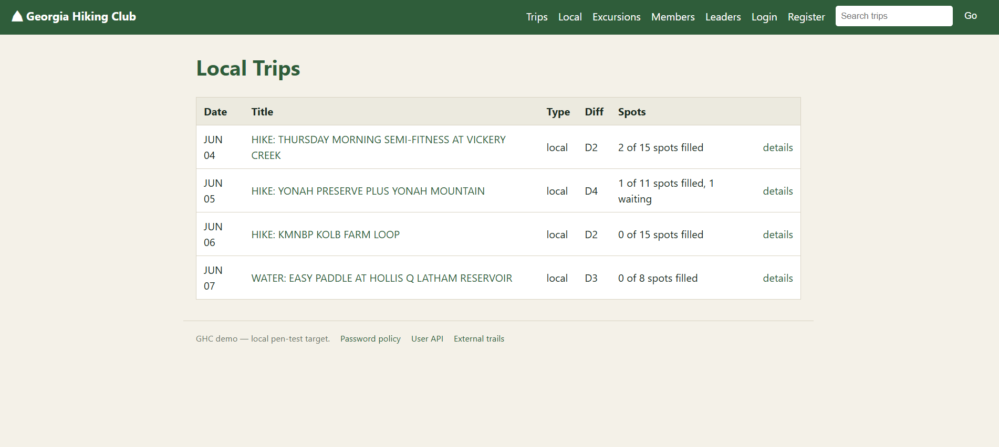
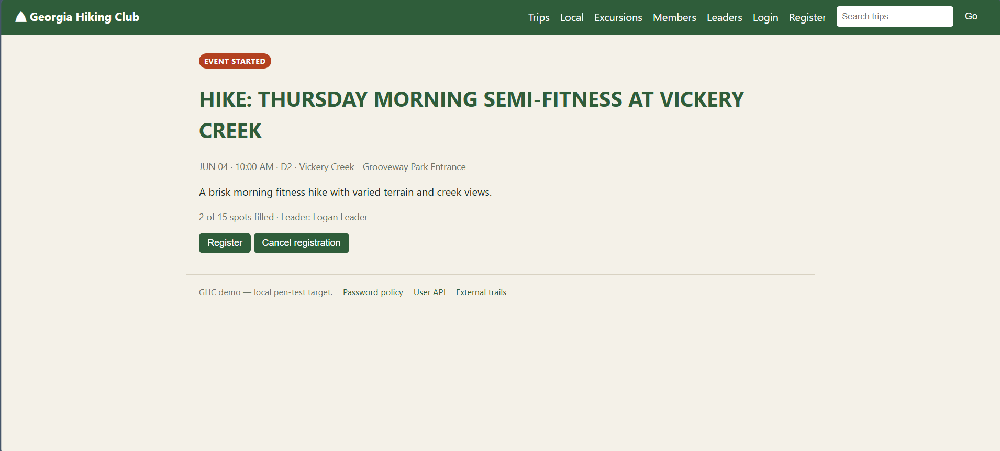
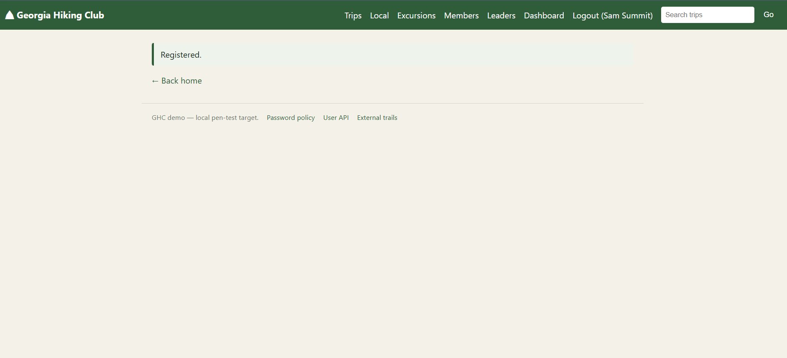
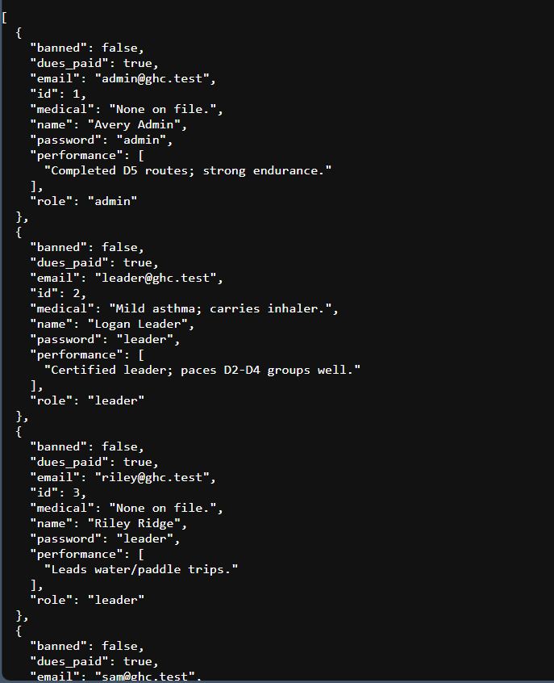
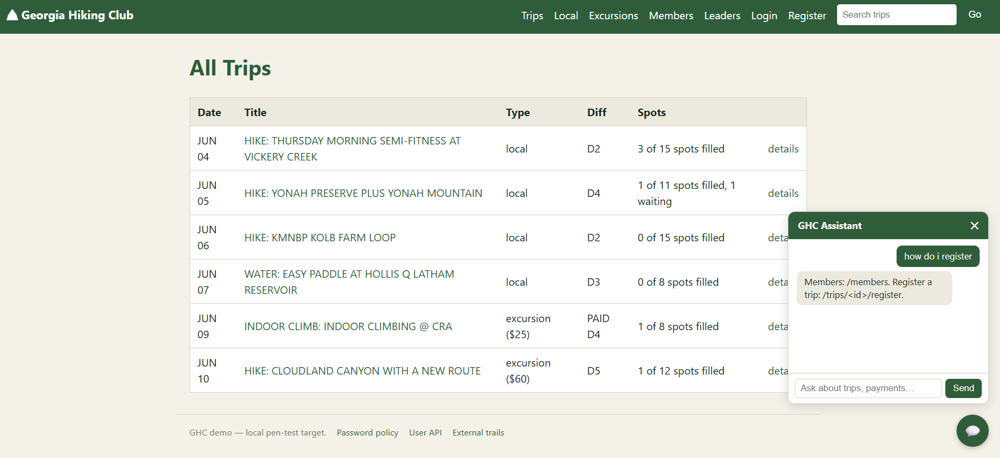
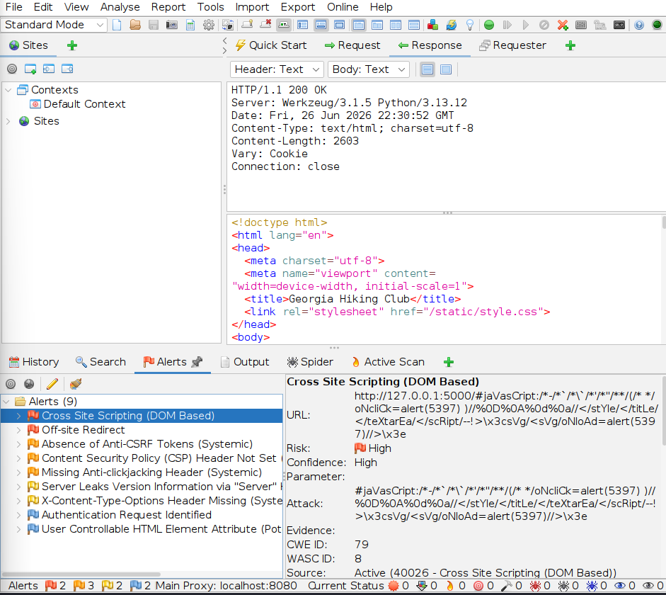
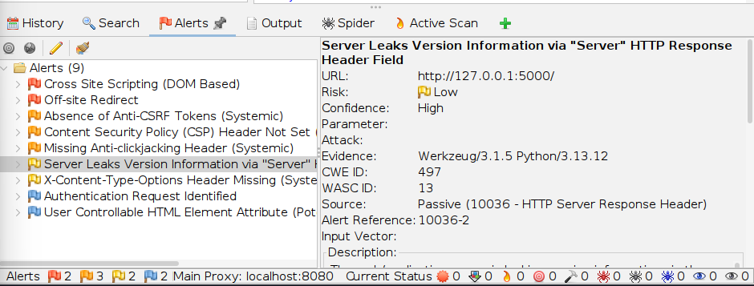

# Penetration Testing Lab 2 — Web Application Deep Dive
**MSSE 642 — Hands-On Project #4**<br>
**Author:** Clayton Conn<br>
**Date:** 2026-06-24

---

## Part 1: Web Application Penetration Testing Procedure

### Summary Table

| PHASE | DESCRIPTION | TOOL |
|-------|-------------|------|
| Website Penetration Testing: Information Gathering (Ch 14) | Information gathering is the first phase of web application penetration testing. The tester passively and actively collects data about the target site — its directory structure, hidden files, subdomains, server technology, and exposed endpoints — without yet attempting to exploit anything. The goal is to build a complete map of the attack surface. For the Hiking Club app, this means discovering all routes (`/members`, `/admin`, `/payments`, etc.), identifying the Flask framework in use, and locating any endpoints that are not linked from the UI but may still be accessible. The more complete the map, the more targeted and effective the subsequent attack phases will be. | **DirBuster** |
| Website Penetration Testing: Gaining Access (Ch 15) | The gaining access phase uses the map built during information gathering to actively probe the application for exploitable vulnerabilities. The tester attempts to bypass authentication, inject malicious input, manipulate request parameters, and access data or functionality that should be restricted. For the Hiking Club app, this means testing whether unauthenticated users can reach admin-only routes like `/admin/members/<id>/ban`, whether member IDs can be enumerated via `/members/<id>`, and whether the login and password-change endpoints are susceptible to brute-force or injection attacks. Automated scanners are combined with manual verification to confirm findings. | **OWASP ZAP** |

---

### Tool Description and Analysis

---

#### DirBuster

**Vendor Website:** [https://www.kali.org/tools/dirbuster/](https://www.kali.org/tools/dirbuster/)

**Description:** DirBuster is a multi-threaded Java application developed by OWASP that performs brute-force discovery of directories and files on web servers. It works by submitting HTTP requests using large wordlists of common directory and file names and recording which paths return valid responses (200, 301, 403) versus 404 Not Found. The tool supports recursive directory scanning, meaning it will automatically descend into discovered directories to find nested paths, making it highly effective at mapping the complete URL space of a web application.

**Kali Linux Availability:** DirBuster is **included in Kali Linux 2019** and can be launched directly from the Applications menu under Web Application Analysis, or via the terminal with `dirbuster`.

**Application to the Hiking Club App:** The Hiking Club application has approximately 40 routes spread across multiple resource areas — members, trips, payments, leaders, auth, and admin. Not all of these routes are linked from the homepage or event detail pages; several sensitive endpoints like `/admin/members/<id>/ban`, `/members/<id>/medical`, and `/security/password-policy` would not be discoverable by simply browsing the UI. DirBuster would be pointed at the Hiking Club VM's IP address (e.g., `http://192.168.56.X:5000/`) with a wordlist containing common REST API path segments. The scan would systematically probe path combinations and reveal the full set of accessible routes. This information becomes the input for the gaining access phase — any route that returns a non-404 response is a confirmed attack surface worth testing for authorization bypass, injection, or improper access control.

---

#### OWASP ZAP (Zed Attack Proxy)

**Vendor Website:** [https://www.zaproxy.org/](https://www.zaproxy.org/)

**Description:** OWASP ZAP is a free, open-source web application security scanner maintained by the Open Worldwide Application Security Project (OWASP). It functions as an intercepting proxy, sitting between the tester's browser and the target application to capture, inspect, and replay all HTTP traffic. ZAP includes both passive scanning (flagging issues observed in normal traffic) and active scanning (automatically sending crafted attack payloads to discover vulnerabilities such as SQL injection, cross-site scripting, broken access control, and sensitive data exposure).

**Kali Linux Availability:** OWASP ZAP is **included in Kali Linux 2019** and is accessible from the Applications menu under Web Application Analysis, or via the terminal with `zaproxy`.

**Application to the Hiking Club App:** With the Hiking Club app deployed on a VM in the penetration testing lab, ZAP would be configured as a proxy and the tester would browse through the application normally — viewing events, signing up, and interacting with the chatbot — allowing ZAP to passively build a site map of all observed traffic. An active scan would then be launched against the full site map, targeting every discovered URL and parameter. For the Hiking Club specifically, ZAP would probe the `/auth/login` endpoint for brute-force susceptibility, test the `/members/<id>` and `/trips/<id>` routes for insecure direct object reference (IDOR) vulnerabilities, check the chatbot's `/api/chat` endpoint for injection, and flag any routes that return sensitive data without requiring authentication. The ZAP report, including alert severity levels and remediation recommendations, forms the deliverable for Part 4 of this assignment.

---

### References

Singh, G. (2019). *Learn Kali Linux 2019: Perform powerful penetration testing using Kali Linux, Metasploit, Nessus, Nmap, and Wireshark*. Packt Publishing.

OWASP Foundation. (n.d.). *OWASP ZAP*. https://www.zaproxy.org/

OWASP Foundation. (n.d.). *DirBuster*. https://www.kali.org/tools/dirbuster/

---

## Part 2: Hiking Club Web Application

### Overview

The Hiking Club web application is a Flask-based web app that simulates a real hiking club management system. The homepage displays a live events board with upcoming hikes, paddles, and climbs — each card showing the date, difficulty rating, available spots, and registration status. Clicking an event navigates to a detail page where members can sign up, which triggers a confirmation page. Beyond the UI, the app exposes approximately 40 REST-style API routes covering member management, trip registration, payments, leader compliance tracking, authentication, and admin functions — providing a realistic and broad attack surface for penetration testing.

### How It Was Built

The application was built using Claude and Claude Code as the primary agentic development tools. The starting point was the in-class code session: the API route stubs in `app.py` were pulled from the class repository, giving a complete skeleton of the application's endpoint structure. Claude Code was then used to build out the full application on top of that foundation — generating the Jinja2 HTML templates, CSS styling, event data, and chatbot logic.

The development process required iteration. The first prompt was intentionally broad, asking Claude Code to build a hiking club web app from the existing routes. The result was minimal — functional routes but little in the way of a real user interface. A more specific second prompt described the desired UI in detail: an events board with date cards, status badges (Register Now, Waiting List, Event Started), difficulty ratings, and a chatbot widget. That second attempt produced a complete, working demo of the Hiking Club application with a polished frontend that reflects what a real member-facing site would look like. After looking through the application, I realized the chat bot wasn't placed into the new app layout, so a third prompt was necessary to produce a complete working app including the chat bot and all api routes. 

### Screenshots

**Screenshot 1 — Homepage: Upcoming Events Board**



**Screenshot 2 — Event Detail Page**



**Screenshot 3 — Signup Confirmation Page**



**Screenshot 4 — API Route Stub (Members)**



**Screenshot 5 — Chatbot Interaction**



---

## Part 3: Deployment on Penetration Testing Lab VM

### Overview

The Hiking Club Flask application was deployed on the Kali Linux VM (`192.168.56.101`) to serve as the penetration testing target for Parts 1 and 4 of this assignment.

### Transfer

The application files were transferred from the Windows host to the Kali VM using VirtualBox's built-in drag-and-drop feature. The entire `hikingclub/` project folder was dragged directly from Windows Explorer into the Kali desktop, which placed it at `/home/kali/hikingclub`. This was the simplest possible transfer method and required no additional tooling.

### Dependency Installation

With the project on the VM, the next step was to create a Python virtual environment and install the Flask dependency listed in `requirements.txt`. This is where a small roadblock was encountered: the Kali VM was configured with only a Host-Only adapter for lab isolation, meaning it had no internet access and could not reach PyPI to download packages.

The solution was the same approach used during Project 1 for installing Nessus — a second network adapter set to NAT was temporarily added to the Kali VM through VirtualBox settings, providing internet access through the host machine. With the NAT adapter active, the following commands were run on the VM:

```bash
cd /home/kali/hikingclub
python3 -m venv .venv
source .venv/bin/activate
pip install -r requirements.txt
```

Once Flask was installed successfully, the NAT adapter was removed to restore lab isolation.

### Running the Application

The Flask development server was started with:

```bash
flask run --host=0.0.0.0 --port=5000
```

The `--host=0.0.0.0` flag binds Flask to all network interfaces rather than just localhost, making the app reachable at `http://192.168.56.101:5000` from the host machine and other VMs on the Host-Only network — which is necessary for running DirBuster and ZAP scans against it.

---

## Part 4: OWASP ZAP Pen Testing Results

### Scan Overview

An automated scan was run against the Hiking Club application at `http://127.0.0.1:5000` using OWASP ZAP 2.17.0. ZAP spidered 38 endpoints and issued a full active scan. The scan produced **9 alerts** across four severity levels: 2 High, 3 Medium, 2 Low, and 2 Informational.

### Alert Summary

| Risk | Count | Alert Types |
|------|-------|-------------|
| High | 2 | DOM-Based XSS, Off-site Redirect |
| Medium | 3 | Absence of Anti-CSRF Tokens, CSP Header Not Set, Missing Anti-Clickjacking Header |
| Low | 2 | Server Version Disclosure, X-Content-Type-Options Missing |
| Informational | 2 | Authentication Request Identified, User Controllable HTML Attribute |

---

### Images

**Screenshot 1 — ZAP Alerts Summary**



**Screenshot 2 — Server Version Disclosure**



### High Risk Findings

#### 1. Cross-Site Scripting — DOM Based (High Confidence)

ZAP successfully injected a JavaScript payload through the application's search input field (`/search?q=`) and chatbot input. The payload was reflected into the DOM without sanitization, triggering a JavaScript `alert()` call. This is a confirmed DOM XSS vulnerability (CWE-79, OWASP 2021 A03).

In the context of the Hiking Club app, this is particularly significant because the chatbot widget on every page accepts freeform text input and writes responses directly to the DOM. An attacker who can control the chatbot's response (or inject through the search field) could steal session cookies, redirect users to phishing pages, or execute arbitrary JavaScript in any visitor's browser.

**Remediation:** Sanitize all user-supplied input before writing it to the DOM. Replace `innerHTML` or direct DOM writes with `textContent`. Implement a Content Security Policy to restrict script execution.

---

#### 2. Off-site Redirect (Medium Confidence)

ZAP flagged the `/go?url=` endpoint in the site's footer ("External trails" link). The `url` parameter is passed directly to Flask's `redirect()` function without validation, allowing an attacker to supply any destination URL. A crafted link like `http://192.168.56.101:5000/go?url=https://malicious.example.com` would redirect a victim to an attacker-controlled site while appearing to originate from the trusted Hiking Club domain — a classic phishing vector (CWE-601, OWASP 2021 A03).

**Remediation:** Replace the open redirect with either a hard-coded URL or a whitelist of approved destinations. Never pass a user-supplied URL directly to a redirect function.

---

### Medium Risk Findings

#### 3. Absence of Anti-CSRF Tokens

The login form at `/auth/login` (and other HTML forms in the application) do not include CSRF tokens. This means a malicious third-party page could submit forged requests to the Hiking Club app on behalf of an authenticated user — for example, silently changing a password or submitting a trip registration — because the browser would automatically include the user's session cookie with any cross-origin POST request (CWE-352).

**Remediation:** Integrate Flask-WTF or Flask-SeaSurf to generate and validate CSRF tokens on all state-changing form submissions.

---

#### 4. Content Security Policy (CSP) Header Not Set

No `Content-Security-Policy` HTTP response header is present on any page. CSP is a browser-enforced defense-in-depth control that restricts which scripts, styles, and resources a page is allowed to load. Without it, the DOM XSS finding above has no secondary mitigation — injected scripts execute without restriction (CWE-693, OWASP 2021 A05).

**Remediation:** Add a CSP header via Flask's `after_request` hook or the Flask-Talisman extension. A minimal starting policy would be `default-src 'self'`.

---

#### 5. Missing Anti-Clickjacking Header

No `X-Frame-Options` or CSP `frame-ancestors` directive is set. This means the Hiking Club app could be embedded inside an `<iframe>` on an attacker's page, enabling a clickjacking attack where a victim is tricked into clicking UI elements — such as a "Register" button or payment form — that are invisible but positioned over attacker-controlled content (CWE-1021, OWASP 2021 A05).

**Remediation:** Add `X-Frame-Options: DENY` to all responses, or include `frame-ancestors 'none'` in the CSP header.

---

### Low Risk Findings

#### 6. Server Version Disclosure

Every HTTP response includes a `Server: Werkzeug/3.1.5 Python/3.13.12` header. This reveals the exact web framework and Python version in use, giving an attacker a precise fingerprint to look up known CVEs for that stack.

**Remediation:** Suppress the `Server` header or replace it with a generic value.

#### 7. X-Content-Type-Options Header Missing

The `X-Content-Type-Options: nosniff` header is absent. Without it, browsers may attempt to infer the content type of a response rather than trusting the declared `Content-Type`, which can enable MIME-sniffing attacks where a file uploaded as plain text is executed as JavaScript.

**Remediation:** Add `X-Content-Type-Options: nosniff` to all responses.

---

### Informational Findings

ZAP also flagged two informational items: it identified the `/auth/login` endpoint as an authentication form (useful context for targeted brute-force testing), and noted that several HTML attributes accept user-controllable values which could be potential XSS vectors requiring manual verification.

---

### Summary and Observations

The two High-severity findings — DOM XSS and the open redirect — are the most immediately exploitable vulnerabilities in the Hiking Club application. Both are rooted in the same root cause: user-supplied input is passed to output functions (the DOM and Flask's `redirect()`) without validation or encoding. The Medium findings are all absent security headers, which are quick wins: a single Flask middleware addition would address the CSP, clickjacking, and content-type findings simultaneously. The CSRF gap on the login form is the most structurally significant Medium finding, as it enables cross-origin forged requests against any authenticated user.
